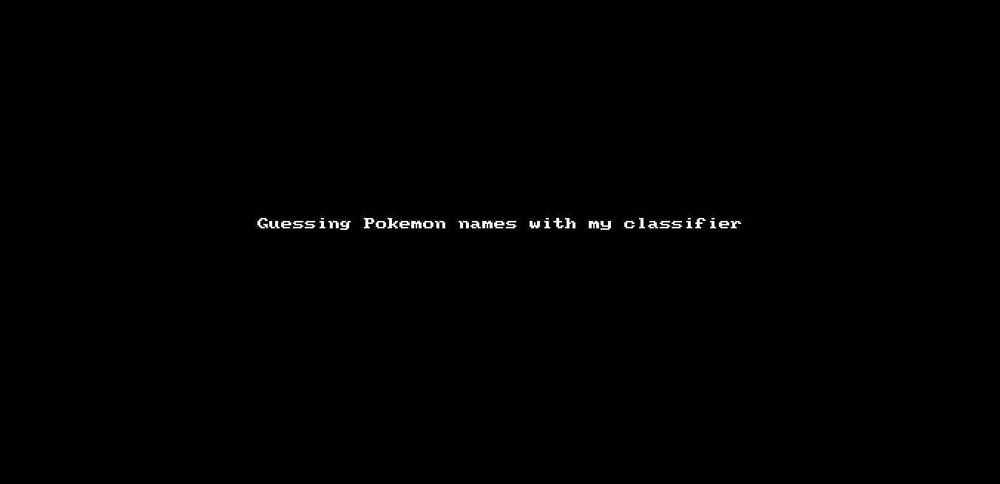

# Pokemon Classifier

This repo is a part of my study in deep learning with [fast.ai](https://www.fast.ai), this app uses this template [repo](https://github.com/render-examples/fastai-v3).  thanks to them for the starter code and the [fast ai MOOC](https://course.fast.ai/) for making it easy to build deep learning models, and also the creator of this <pre><code><del>[dataset](https://kaggle.com/mrgravelord/complete-pokemon-image-dataset)</del></pre></code> for putting up a curated dataset (removed from kaggle).

I have also hosted this web app on heroku, Check it out [here](https://pokemon-classifier.herokuapp.com). 

Blog post explaining the model building process [here](https://mani2106.github.io/Blog-Posts/pokemon-classifer/image-classification/fastai/2019/06/01/Fast_ai_lesson_2_pokemon_classifier.html).

## Demo

